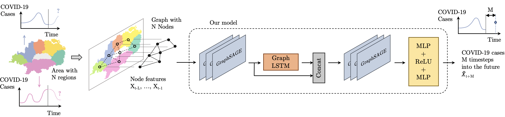

#Integrating LSTMs and GNNs for COVID-19 Forecasting

by Nathan Sesti, Juan Jose Garau-Luis

This paper was submitted and accepted to the ICML 2021 Time Series Workshop.

## Abstract

> The spread of COVID-19 has coincided with the rise of Graph Neural Networks (GNNs), leading to several studies proposing this method to better forecast the evolution of the pandemic. Many of the models also include Long Short Term Memory (LSTM) networks, a common tool for time series forecasting. In this work, we further investigate their integration by implementing GNNs within the gates of an LSTM and exploiting spatial information. In addition, we introduce a skip connection which proves critical to jointly capture the spatial and temporal patterns in the data. We validate our model on data of daily COVID-19 cases in 37 European nations for the last 472 days and show superior performance compared to state-of-the-art graph time series models. This area of research has important applications to policy-making and we analyze its potential for pandemic resource control.

## Using this repository

1) Tweak the parameters in `parameters.py`.
2) Run `covid_recurrent.py` to train and predict.
3) A .json file containing losses and other relevant training data is saved under `results/`.
4) Use `reports.py` to convert one or more results files into a matplotlib graphic.

## Datasets

Datasets used in this project include:

* [Facebook Social Connectedness Index](https://dataforgood.fb.com/tools/social-connectedness-index/) - Edge weight feature.
* [Population-weighted european state centers](https://cs.baylor.edu/~hamerly/software/europe_population_weighted_centers.html) - Used to calculate geodesic distance, an edge weight feature.
* [Global Transnational Mobility Dataset](https://zenodo.org/record/3911054#.YOHoXRNKi3I) - Edge weight feature
* [John Hopkins COVID-19 Data Repository](https://github.com/CSSEGISandData/COVID-19) - Daily cases and other node features used in prediction

## License

All of this repository's code is made available under the MIT license.